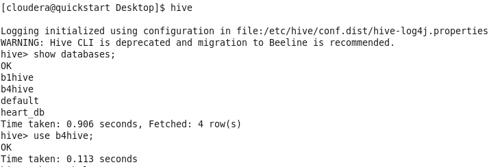
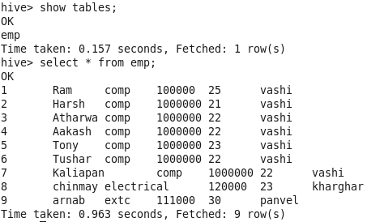
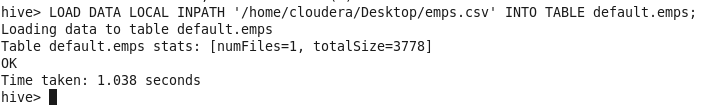
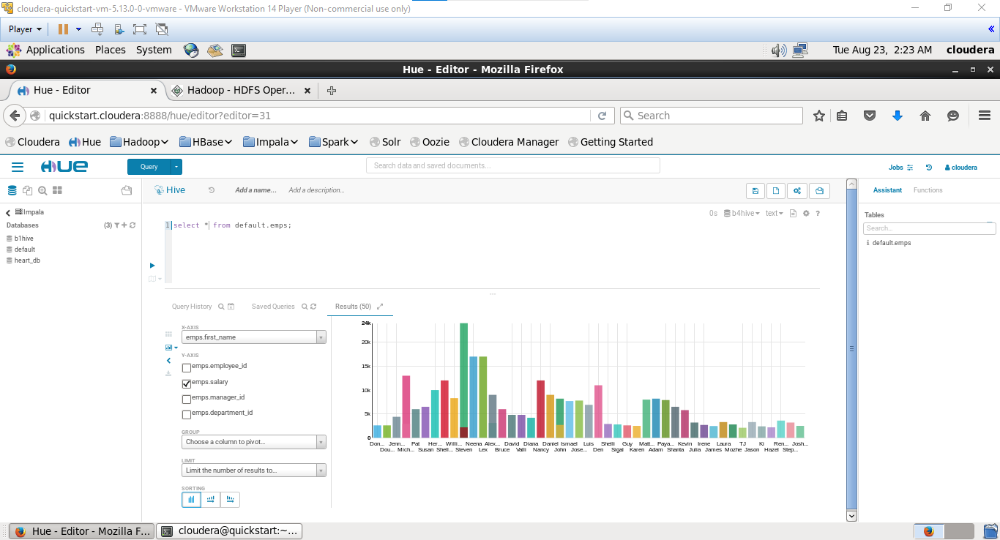
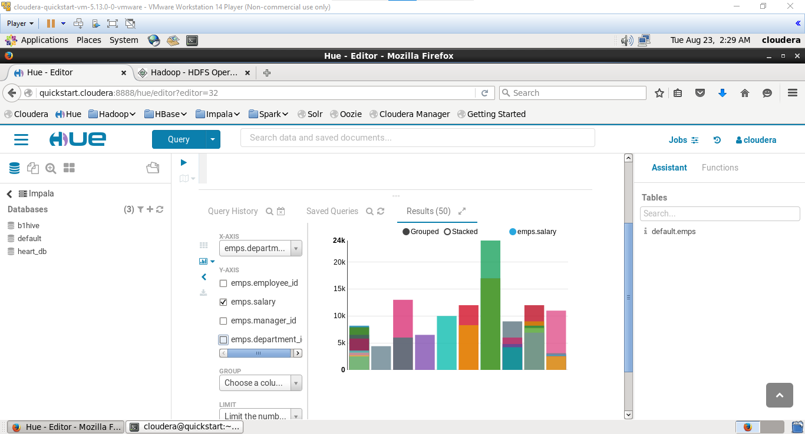
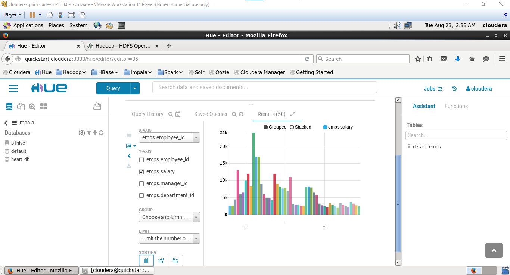
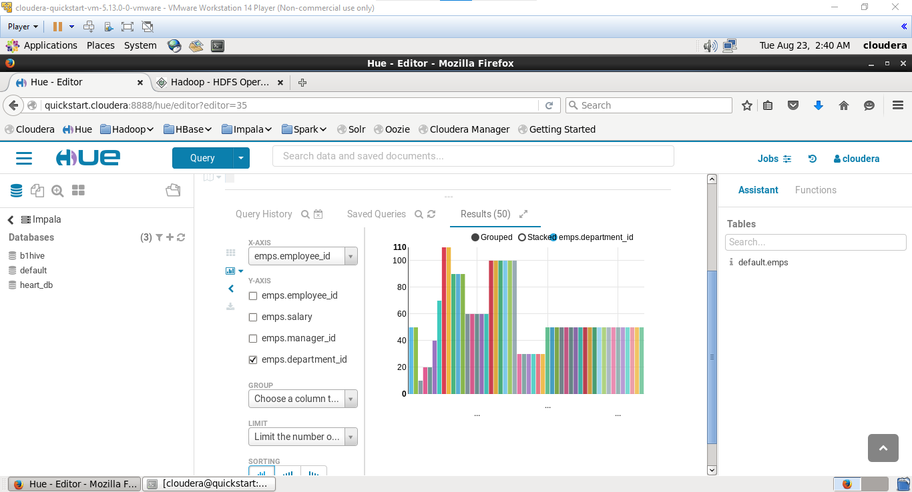

# BDA LAB 6

## AIM:

## Theory:

hive:

hql:

## Output

doing via hive in command line

Doing via hive web app

uploading employees.csv

[Dataset](https://gist.github.com/kevin336/acbb2271e66c10a5b73aacf82ca82784)

Q1. retrive total salary of each department

Ans:

Q2. Retrive employee with highest salary

Ans:

Q3. Count total no of emp in each department

Ans:

## Conslusion

